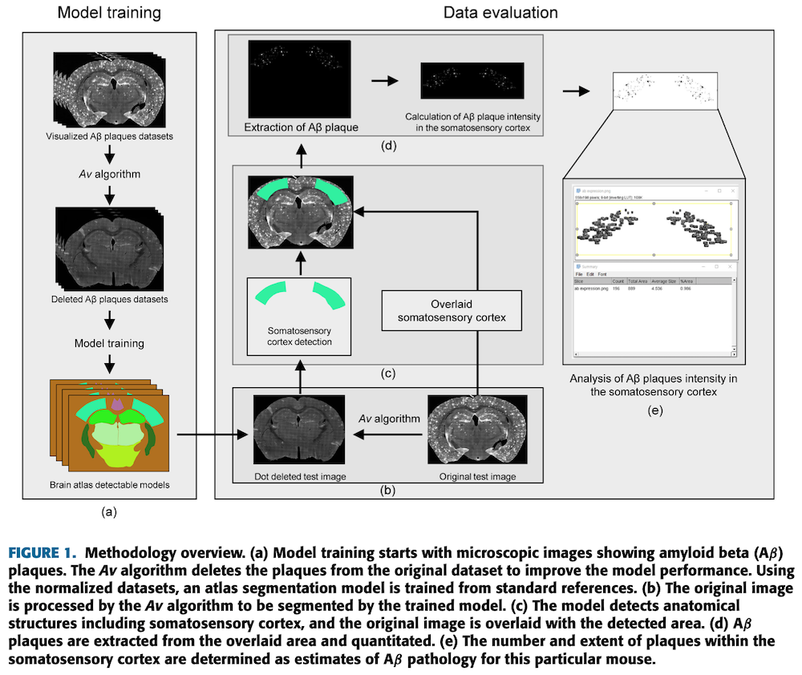
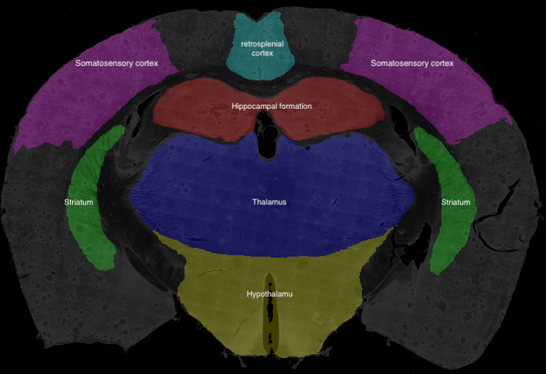
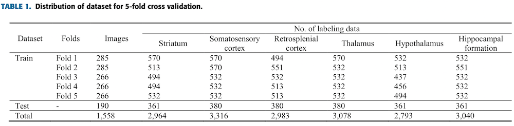
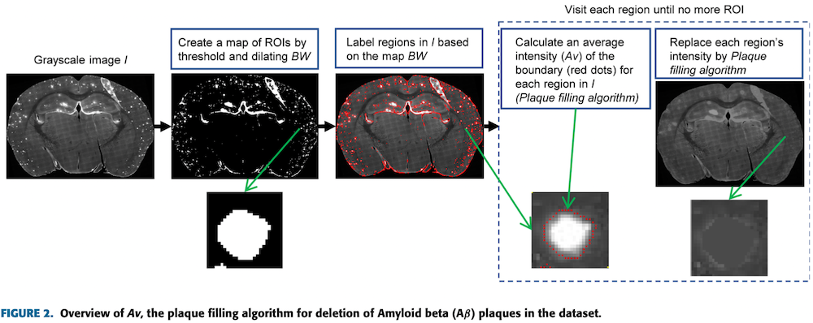
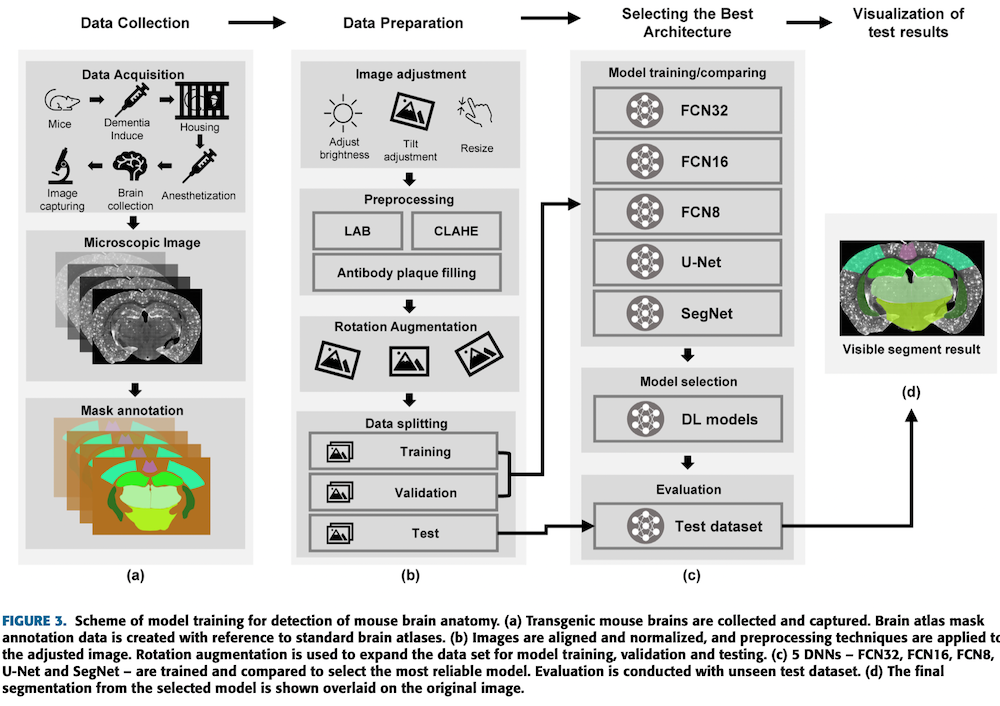
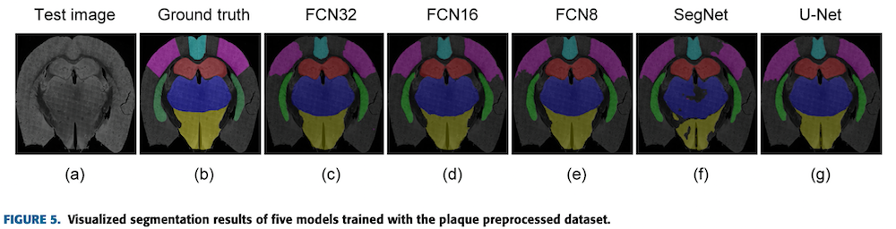
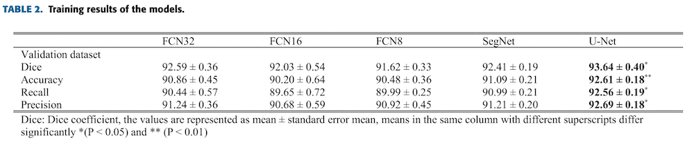
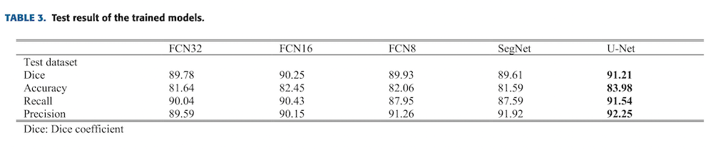
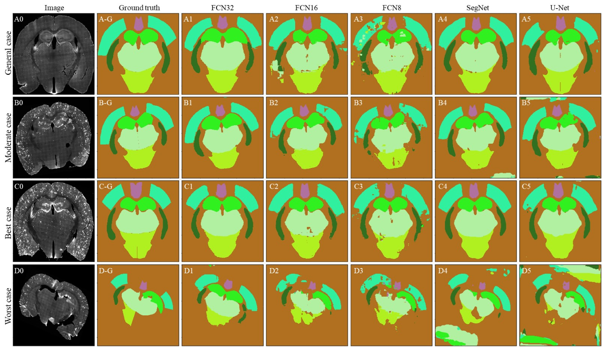
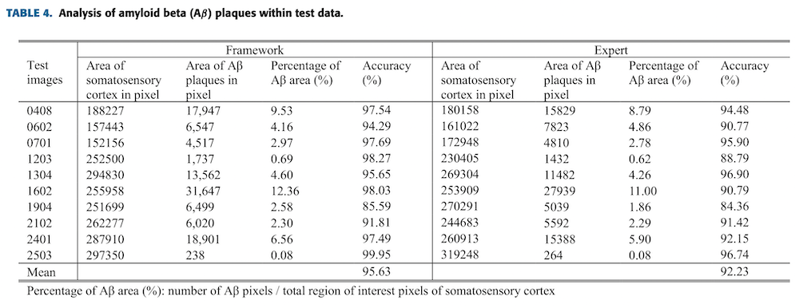

# Segmentation of Mouse Brain Atlas

 

 

## Automatic Detection of Amyloid Beta Plaques in Somatosensory Cortex of an Alzheimer’s Disease Mouse Using Deep Learning

## ABSTRACT

Identification of amyloid beta (Aβ) plaques in the cerebral cortex in models of Alzheimer’s Disease (AD) is of critical importance for research into therapeutics. Here we propose an innovative framework which automatically measures Aβ plaques in the cortex of a rodent model, based on anatomical segmentation using a deep learning approach. The framework has three phases: data acquisition to enhance image quality using preprocessing techniques and image normalization with a novel plaque removal algorithm, then an anatomical segmentation phase using the trained model, and finally an analysis phase to quantitate Aβ plaques. Supervised training with 946 sets of mouse brain section annotations exhibiting Aβ protein-labeled plaques (Aβ plaques) were trained with deep neural networks (DNNs). Five DNN architectures: FCN32, FCN16, FCN8, SegNet, and U-Net, were tested. Of these, U-Net was selected as it showed the most reliable segmentation performance. The framework demonstrated an accuracy of 83.98% and 91.21% of the Dice coefficient score for atlas segmentation with the test dataset. The proposed framework automatically segmented the somatosensory cortex and calculated the intensity and extent of Aβ plaques. This study contributes to image analysis in the field of neuroscience, allowing region-specific quantitation of image features using a deep learning approach. 

## FRAMEWORK OVERVIEW
 

The framework proposed in this paper has three phases. First, a data acquisition phase improves image quality with preprocessing techniques and normalization using a novel plaque removal algorithm. Second, the anatomical segmentation phase uses the trained model to identify regions of interest (ROIs), and thirdly the analysis phase quantitates Aβ plaques within the ROIs of the original images. 

The DNNs model is trained with the set of preprocessed images to infer brain atlas regions from section images. (Figure 1a). Utilizing the trained model, an atlas is inferred from the preprocessed input image so that the somatosensory cortex ROI can be identified (Figure 1b). This is then overlaid on the original image (Figure 1c), and the somatosensory area is extracted as regions of interest (Figure 1d). Finally, Aβ plaques in these ROIs are quantitated for analysis (Figure 1e). 

## DATA OVERVIEW
 

**Images** : `1558 images`  
**Subjected Mouse** : `21 mice`  
**Class** : `6` `hippocampal formation, thalamus, hypothalamus, retrosplenial cortex, somatosensory cortex, striatum`  
**External Augmentation** : `Rotation (factor=2, range=±18)`  
**Internal Augmentation** : `Brightness (Random, range=±40)`  
**Image size** : `1750 x 1250`  

🌱 DATA DIVISION 
 

## IMAGE PREPROCESSING
🌱 Aβ PLAQUE DELETION 
 

To allow the model to segment images more efficiently, an infilling method was employed as a simple and efficient method to clean the images (Figure 2). This process is important to improve the DNN model’s performance and capacity: deleting the plaques from the input image allows the framework to perform consistent segmentations regardless of plaque load.

RGB images were converted to grayscale images by eliminating hue and saturation, whilst retaining the luminance, as shown in equation:

$$ (0.2989×R) + (0.5870×G) + (0.1140×B) $$

## MODEL TRAINING SCHEME
 

All configurations were set to be equal for a fair comparison, minimizing any possible variants between model training processes. After several attempts, the training hyperparameters were experimentally determined as follows: training for 100 epochs with 512 steps per epoch, a learning rate of 0.001 optimized using an Adam optimizer, and a batch size of 1.
 

To analyze pathology, an Aβ plaque quantitation step was then performed. Using the brain atlas overlay to extract the somatosensory cortex area from the original images, the number and pixel extent of Aβ plaques was calculated as an estimate of plaque load in this region.
 

## SEGMENTATION MODEL TRAINING RESULT

 
Figure 5 shows the segmentations produced by these five models trained on the preprocessed test dataset. FCN32 (Figure 5c) and U-Net (Figure 5g) are the most accurate, with very few false positive pixels, while FCN8 (Figure 5e) and SegNet (Figure 5f) show relatively low segmentation accuracy. FCN8 shows false positive pixels in the somatosensory cortex and thalamus, whereas SegNet shows many true negative pixels in both the somatosensory cortex and hypothalamus. 
 
 
 
 
 
🌱 Model inference result per case
 

## AUTOMATIC Aβ PLAQUE DETECTION IN SOMATOSENSORY CORTEX
 

## Further Things to do
🌱 Training with more detailed class of brain atlas  
🌱 Implementation of User-level interface for domain experts (neuroscientist) 
🌱 Quantification of other section of brain  
🌱 Develop segmentation model of another way of brain slice  

## System Utilized
- GPU : NVIDIA RTX1080
- Ubuntu : 16.04.6 LTS
- Conda : 4.7.11
- Python : 3.8.3

## packages in virtual environment
- numpy
- opencv-python
- pandas
- Pillow
- Keras
- imgaug

## Full Paper
* https://ieeexplore.ieee.org/document/9634031/
* (DOI:10.1109/ACCESS.2021.3132401)

## Reference
* code base : https://github.com/boguss1225/image-segmentation-keras

